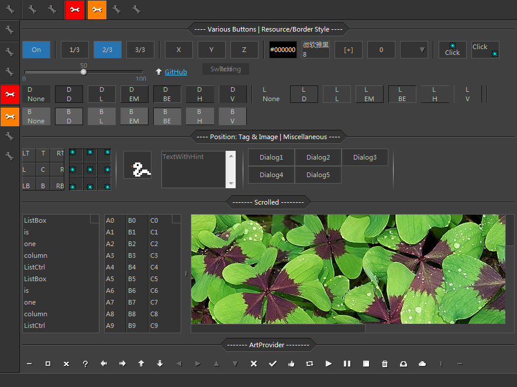

#  DynaUI

DynaUI is a framework to increase the apperance, scalability and flexibility of wxPython.
It provides the following functions:
* A `BaseControl` as the root class for customized widgets. It deals with resource management and supports animation (such as smooth color transition of buttons when being hovered).
The intrinsic animation capability can be used for animating any changes over time, instead of just display changes.
* A Dialog system for high-level defination of dialogs. It provides high-level APIs for the creation, positioning/sizing, and interaction of widgets for dialogs.
* Bitmap font support
* Resource management
* Easy customization of colors, fonts, etc, across the whole the GUI
* Various kinds of buttons, button-like widgets, and other commonly used widgets
* Scrolled window implemented from scratch, so that the ugly native scroll-bars won't interrupt the look of the UI
* Built-in animation of common buttons

To get started, install with pip:

    pip install dynaui

To see the demo, use command:

    python -m DynaUI.demo.demo

As long as you know how to use wxPython, you should be able use the widgets in this package easily.
Here is a screenshot of some of the widgets and their different styles.
You can find their usages in `DynaUI.demo.demo.py`

To create your own customized animated widgets, see the implementations of the provided widgets in `DynaUI.controls`.

An example use of this package: [LabPype](https://github.com/NCBI-Hackathons/LabPype)
